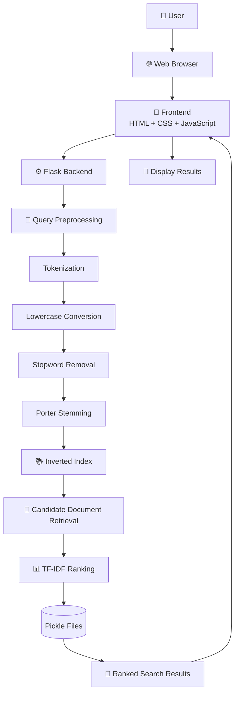

# 🔍 Advanced VR Search Engine


---

## 📌 Overview

Advanced VR Search Engine is a web-based information retrieval system developed using Flask and NLTK. The project demonstrates the implementation of core search engine concepts such as document preprocessing, inverted indexing, TF-IDF ranking, and query processing through a modern web interface.

---

## ✨ Features

- Document preprocessing using NLTK
- Tokenization, Stopword Removal & Stemming
- Inverted Index construction
- TF-IDF based document ranking
- Fast keyword search
- Responsive Bootstrap interface
- About and Contact pages
- Custom website shortcuts

---

## 🛠️ Tech Stack

- **Backend:** Flask, Python
- **NLP:** NLTK
- **Information Retrieval:** Inverted Index, TF-IDF
- **Frontend:** HTML5, CSS3, Bootstrap 5, JavaScript

---

## 🏗️ System Architecture



---

## ⚙️ Data Processing Workflow


---

## Screenshots


---

## 🚀 Installation

```bash
git clone https://github.com/vedant333444/search_engine_project.git

cd search_engine_project

python -m venv venv

# Windows
venv\Scripts\activate

pip install -r requirements.txt

python app.py
```

## 🌐 Live Demo

**Try the application here:**

https://vr-search-engine.onrender.com

---

## 📁 Project Structure

```text
search_engine_project/
│
├── app.py
├── build_index.py
├── calculate_tfidf.py
├── process_data.py
├── convert_csv_to_txt.py
├── download_nltk_data.py
│
├── data/
│   ├── raw/
│   └── processed/
│
├── static/
│   ├── style.css
│   └── script.js
│
├── templates/
│   ├── index.html
│   ├── about.html
│   └── contact.html
│
├── README.md
├── requirements.txt
├── .gitignore
└── LICENSE
```

---

## 🚀 Future Improvements

- Autocomplete Suggestions
- Boolean Search
- Phrase Search
- Wildcard Search
- Spell Correction
- Voice Search
- Semantic Search using Sentence Transformers
- Elasticsearch Integration

---

## 👨‍💻 Authors

- Vedant Singhal
- Ravi Kumar

---

## 📄 License

This project is licensed under the MIT License.

